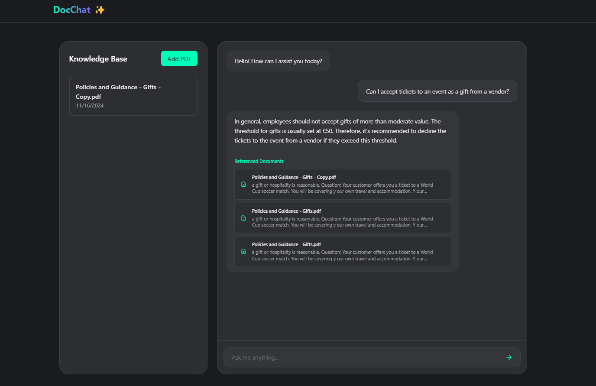
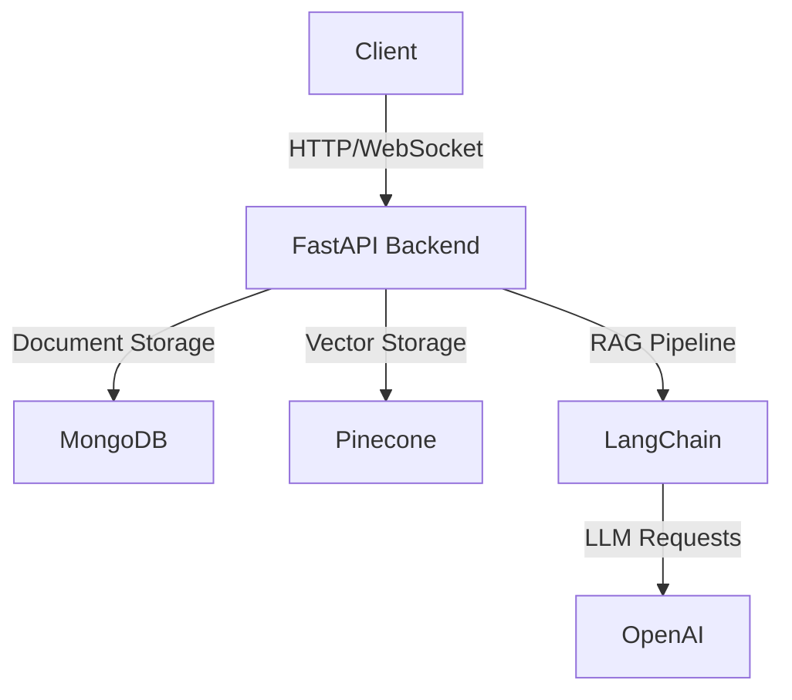

[](http://creativecommons.org/publicdomain/zero/1.0/)
[](https://fastapi.tiangolo.com/)
[](https://reactjs.org/)
[](https://www.typescriptlang.org/)
[](https://www.python.org/)
[](https://www.mongodb.com/)
[](https://www.pinecone.io/)
[](https://openai.com/)
[](https://langchain.com/)
[](https://www.docker.com/)
[](https://tailwindcss.com/)
[](https://nodejs.org/)
[](https://jestjs.io/)
[](https://developer.mozilla.org/en-US/docs/Web/API/WebSocket)


[Demo](#) · [Documentation](docs/) · [Report Bug](https://github.com/soheil-mp/DocChat/issues) · [Request Feature]([issues/](https://github.com/soheil-mp/DocChat/issues))

# DocChat 
> 🤖 An intelligent document Q&A chat interface powered by RAG (Retrieval-Augmented Generation) - transform your documents into interactive knowledge bases.

<div align="center">



</div>

## 📋 Table of Contents
- [Features](#-features)
- [Quick Start](#-quick-start)
- [Architecture](#️-architecture)
- [Project Structure](#-project-structure)
- [Tech Stack](#️-tech-stack)
- [API Documentation](#-api-documentation)
- [Configuration](#-configuration)
- [Deployment](#-deployment)
- [Security](#-security)
- [Contributing](#-contributing)
- [Troubleshooting](#-troubleshooting)
- [License](#-license)
- [Contact](#-contact)

## ✨ Features

- 📄 **Smart Document Management**
  - Multi-format support (PDF, DOCX, TXT)
  - Batch uploads with progress tracking
  - Version control & metadata management

- 💬 **AI-Powered Chat**
  - Context-aware responses using RAG
  - Real-time interactions
  - Source citations
  - Conversation history

- ⚙️ **Customization**
  - Multiple LLM providers (OpenAI, Anthropic, Cohere)
  - Adjustable generation parameters
  - Custom prompting
  - Flexible output formatting

## 🚀 Quick Start

### Prerequisites

- Node.js 16+
- Python 3.8+
- MongoDB
- Pinecone account
- OpenAI API key

### Installation

1. **Clone the repository**
```bash
git clone https://github.com/yourusername/DocChat.git
cd DocChat
```

2. **Set up the backend**
```bash
cd backend
python -m venv venv
source venv/bin/activate  # Windows: .\venv\Scripts\activate
pip install -r requirements.txt
cp .env.example .env     # Configure your environment variables
```

3. **Set up the frontend**
```bash
cd frontend
npm install
cp .env.example .env     # Configure your environment variables
```

### Running Locally

1. **Start the backend server**
```bash
cd backend
uvicorn app.main:app --reload
```

2. **Launch the frontend**
```bash
cd frontend
npm start
```

Visit [http://localhost:3000](http://localhost:3000) to see the application.

## 🏗️ Architecture



## 📁 Project Structure

<details>
<summary>Click to expand</summary>

```
DocChat/
├── backend/              # FastAPI server
│   ├── app/
│   │   ├── api/         # REST endpoints
│   │   ├── core/        # Core utilities
│   │   ├── services/    # Business logic
│   │   └── models/      # Data models
│   └── tests/           # Backend tests
├── frontend/            # React application
│   ├── src/
│   │   ├── components/  # UI components
│   │   ├── features/    # Feature modules
│   │   └── lib/        # Utilities
│   └── tests/          # Frontend tests
└── docs/               # Documentation
```

</details>

## 🛠️ Tech Stack

<details>
<summary>Click to expand</summary>

### Frontend
- React 18 with TypeScript
- TailwindCSS & HeadlessUI
- React Query & Zustand
- Jest & Testing Library

### Backend
- FastAPI
- LangChain & LangGraph
- MongoDB & Pinecone
- OpenAI GPT-4

</details>

## 📦 Deployment

### Docker
```bash
docker-compose up --build
```

### Cloud Platforms
- [AWS Deployment Guide](docs/deployment/aws.md)
- [GCP Deployment Guide](docs/deployment/gcp.md)
- [Azure Deployment Guide](docs/deployment/azure.md)

## 🔒 Security

- JWT-based authentication
- Rate limiting
- Input validation
- CORS protection
- Regular security audits

## 🤝 Contributing

1. Fork the repository
2. Create your feature branch (`git checkout -b feature/AmazingFeature`)
3. Commit changes (`git commit -m 'Add AmazingFeature'`)
4. Push to branch (`git push origin feature/AmazingFeature`)
5. Open a Pull Request

## 📝 License

Distributed under the MIT License. See `LICENSE` for more information.

## 📧 Contact

Your Name - [@yourtwitter](https://twitter.com/yourtwitter) - email@example.com

Project Link: [https://github.com/yourusername/DocChat](https://github.com/yourusername/DocChat)

## 🔧 Development

### Code Style

```bash
# Backend
pip install black isort flake8
black .
isort .
flake8

# Frontend
npm run lint
npm run format
```

### Testing

```bash
# Backend
pytest
pytest --cov=app tests/

# Frontend
npm run test
npm run test:coverage
```

## 🐳 Docker Support

### Development
```bash
# Development with hot-reload
docker-compose -f docker-compose.dev.yml up

# Production build
docker-compose -f docker-compose.prod.yml up
```

### Production
```bash
# Build images
docker build -t DocChat-backend -f backend/Dockerfile.prod backend/
docker build -t DocChat-frontend -f frontend/Dockerfile.prod frontend/

# Run containers
docker-compose -f docker-compose.prod.yml up -d
```

## 🔍 Troubleshooting

<details>
<summary>Common Issues</summary>

### Backend Issues
1. **MongoDB Connection Errors**
   ```bash
   # Check MongoDB status
   mongosh
   # Verify connection string in .env
   ```

2. **Pinecone API Issues**
   - Verify API key and environment
   - Check index name and dimension

### Frontend Issues
1. **WebSocket Connection Failed**
   - Verify backend is running
   - Check CORS settings
   - Confirm WebSocket URL

2. **Build Failures**
   ```bash
   # Clear node modules and reinstall
   rm -rf node_modules
   npm install
   ```

</details>

## 📈 Performance

### Optimizations
- Document chunking strategy
- Vector store indexing
- Response streaming
- Frontend caching
- API rate limiting

### Monitoring
- Prometheus metrics
- Grafana dashboards
- Error tracking
- Usage analytics

## 🔄 Updates & Migration

### Version History
- v1.0.0 - Initial release
- v1.1.0 - Added streaming support
- v1.2.0 - Multiple document handling
- v2.0.0 - New UI and improved RAG

### Migration Guides
- [v1.x to v2.x Migration](docs/migration/v1-to-v2.md)
- [Database Schema Updates](docs/migration/database.md)

