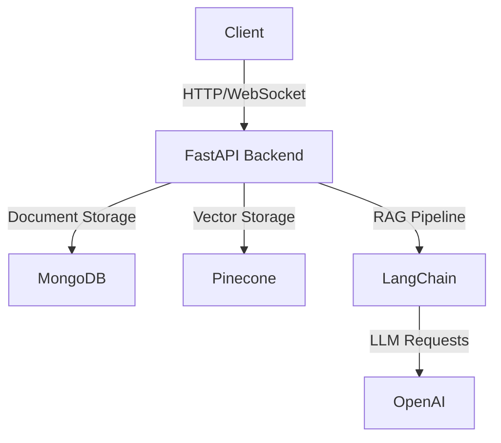

# DocuChat 
> 🤖 An intelligent document chat interface powered by RAG (Retrieval-Augmented Generation)

<div align="center">


*Add a screenshot of your application here*

[](https://choosealicense.com/licenses/mit/)
[](https://fastapi.tiangolo.com/)
[](https://reactjs.org/)
[](https://www.typescriptlang.org/)

[Demo](https://demo-link) · [Documentation](docs/) · [Report Bug](issues/) · [Request Feature](issues/)

</div>

## ✨ Features

- 📄 **Smart Document Management**
  - Multi-format support (PDF, DOCX, TXT)
  - Batch uploads with progress tracking
  - Version control & metadata management

- 💬 **AI-Powered Chat**
  - Context-aware responses using RAG
  - Real-time interactions
  - Source citations
  - Conversation history

- ⚙️ **Customization**
  - Multiple LLM providers (OpenAI, Anthropic, Cohere)
  - Adjustable generation parameters
  - Custom prompting
  - Flexible output formatting

## 🚀 Quick Start

### Prerequisites

- Node.js 16+
- Python 3.8+
- MongoDB
- Pinecone account
- OpenAI API key

### Installation

1. **Clone the repository**
```bash
git clone https://github.com/yourusername/docuchat.git
cd docuchat
```

2. **Set up the backend**
```bash
cd backend
python -m venv venv
source venv/bin/activate  # Windows: .\venv\Scripts\activate
pip install -r requirements.txt
cp .env.example .env     # Configure your environment variables
```

3. **Set up the frontend**
```bash
cd frontend
npm install
cp .env.example .env     # Configure your environment variables
```

### Running Locally

1. **Start the backend server**
```bash
cd backend
uvicorn app.main:app --reload
```

2. **Launch the frontend**
```bash
cd frontend
npm start
```

Visit [http://localhost:3000](http://localhost:3000) to see the application.

## 🏗️ Architecture



## 📁 Project Structure

<details>
<summary>Click to expand</summary>

```
docuchat/
├── backend/              # FastAPI server
│   ├── app/
│   │   ├── api/         # REST endpoints
│   │   ├── core/        # Core utilities
│   │   ├── services/    # Business logic
│   │   └── models/      # Data models
│   └── tests/           # Backend tests
├── frontend/            # React application
│   ├── src/
│   │   ├── components/  # UI components
│   │   ├── features/    # Feature modules
│   │   └── lib/        # Utilities
│   └── tests/          # Frontend tests
└── docs/               # Documentation
```

</details>

## 🛠️ Tech Stack

<details>
<summary>Click to expand</summary>

### Frontend
- React 18 with TypeScript
- TailwindCSS & HeadlessUI
- React Query & Zustand
- Jest & Testing Library

### Backend
- FastAPI
- LangChain & LangGraph
- MongoDB & Pinecone
- OpenAI GPT-4

</details>

## 📦 Deployment

### Docker
```bash
docker-compose up --build
```

### Cloud Platforms
- [AWS Deployment Guide](docs/deployment/aws.md)
- [GCP Deployment Guide](docs/deployment/gcp.md)
- [Azure Deployment Guide](docs/deployment/azure.md)

## 🔒 Security

- JWT-based authentication
- Rate limiting
- Input validation
- CORS protection
- Regular security audits

## 🤝 Contributing

1. Fork the repository
2. Create your feature branch (`git checkout -b feature/AmazingFeature`)
3. Commit changes (`git commit -m 'Add AmazingFeature'`)
4. Push to branch (`git push origin feature/AmazingFeature`)
5. Open a Pull Request

## 📝 License

Distributed under the MIT License. See `LICENSE` for more information.

## 📧 Contact

Your Name - [@yourtwitter](https://twitter.com/yourtwitter) - email@example.com

Project Link: [https://github.com/yourusername/docuchat](https://github.com/yourusername/docuchat)

